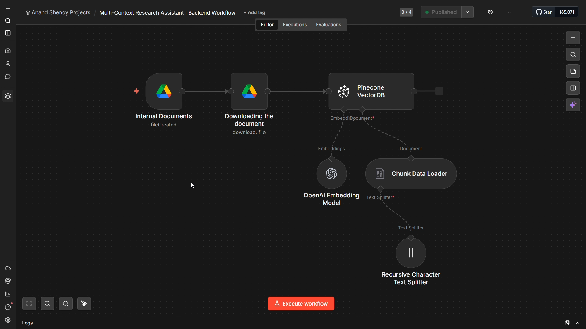

# 🔬 Multi-Context Research Assistant

An AI Agent-powered dual-workflow system built on n8n, designed to help researchers safely extract accurate information from dense academic documents without the risk of AI hallucinations. It features automated Google Drive document ingestion, cloud-based Pinecone vector storage, and a strict Retrieval-Augmented Generation (RAG) pipeline to ensure completely factually grounded answers.

## 📖 Overview

Researchers and students working with dense academic papers often struggle to extract precise answers quickly. Furthermore, general-purpose LLMs frequently "hallucinate" information when they lack native access to specific source materials, making them highly unreliable for document-centric research queries.

This project addresses that gap by deploying a robust, two-part n8n workflow system. The backend automatically watches a Google Drive folder to ingest, chunk, and embed new documents directly into a Pinecone vector database. The frontend operates through a clean Streamlit interface where the AI Agent receives user queries and mandatorily retrieves context from Pinecone. By forcing the LLM to rely strictly on retrieved data and refusing to answer beyond the source material, the system guarantees accurate, hallucination-free research assistance.

## ✨ Key Features

* **Dual-Workflow Architecture:** Two independent n8n workflows — one handling document ingestion and the other handling query answering — keeping data pipeline and conversational logic cleanly separated.
* **Automated Document Ingestion:** A Google Drive Trigger monitors the folder and automatically processes any newly uploaded PDF without manual intervention.
* **Chunked Vector Embedding:** Documents are split into 500-character chunks with 100-character overlap using a Recursive Character Text Splitter before being embedded and stored in Pinecone.
* **Strict Hallucination Control:** The AI Agent is constrained by an engineered system prompt that mandates tool usage before every response and explicitly refuses to answer anything not found in the retrieved document context.
* **Persistent Session Memory:** A Buffer Window Memory node maintains conversation history across turns using a key, enabling coherent multi-turn research conversations.
* **Streamlit Frontend Integration:** A Webhook trigger and Respond to Webhook node bridge the n8n backend to an external Streamlit chat interface via HTTP POST requests.

## 🛠️ Technologies

* **Workflow Orchestration:** n8n (Community Edition — free, self-hosted)
* **Document Source & Trigger:** Google Drive (OAuth2 — folder watch trigger + file download)
* **Text Processing:** n8n Recursive Character Text Splitter (chunk size: 500, overlap: 100)
* **Embedding Model:** OpenAI Embeddings (`text-embedding-3-small` via n8n free OpenAI credits)
* **Vector Database:** Pinecone (index with 1536 dimensions)
* **LLM Provider:** OpenAI Model (`gpt-4o-mini` via n8n free OpenAI credits)
* **AI Orchestration:** n8n AI Agent Node (RAG — retrieve-as-tool mode)
* **Session Memory:** n8n Buffer Window Memory Node
* **Frontend Interface:** Streamlit (communicates via Webhook POST)

## 🔄 Workflow Architecture

The system runs as two separate workflows. The Backend Workflow triggers automatically when a new PDF is uploaded to the designated Google Drive folder, downloads it, loads and chunks the content, generates OpenAI embeddings, and inserts the vectors into the Pinecone index. The Frontend Workflow receives user queries from the Streamlit interface via a webhook, passes them to the AI Agent which mandatorily queries Pinecone for relevant context, generates a grounded response using GPT-4o mini with session memory, and returns the answer back through the webhook to the user.

## 📝 Prerequisites

* An n8n instance — self-hosted via `npm install -g n8n` (Node.js v20+) or n8n Cloud free trial at `app.n8n.cloud`
* An OpenAI API key from `platform.openai.com` (or n8n free OpenAI credits)
* A Pinecone account (free tier) with an index of 1536 dimensions
* A Google account with OAuth2 access granted to n8n and a Google Drive folder designated for document uploads
* A Streamlit application configured to send POST requests to the n8n Frontend Workflow webhook URL

To run the streamlit application locally, ensure that you have the following installed and configured on your machine:

* Python 3.8+
* VS Code (or your preferred Python IDE)
* A virtual environment (recommended)
* Required Python libraries (`requests`, `python-dotenv` and `streamlit`)
* Webhook Production URL (stored securely in a `.env` file as `N8N_WEBHOOK_URL`)

## 🎥 Project Demonstration

Click to watch the demo!

  

  

