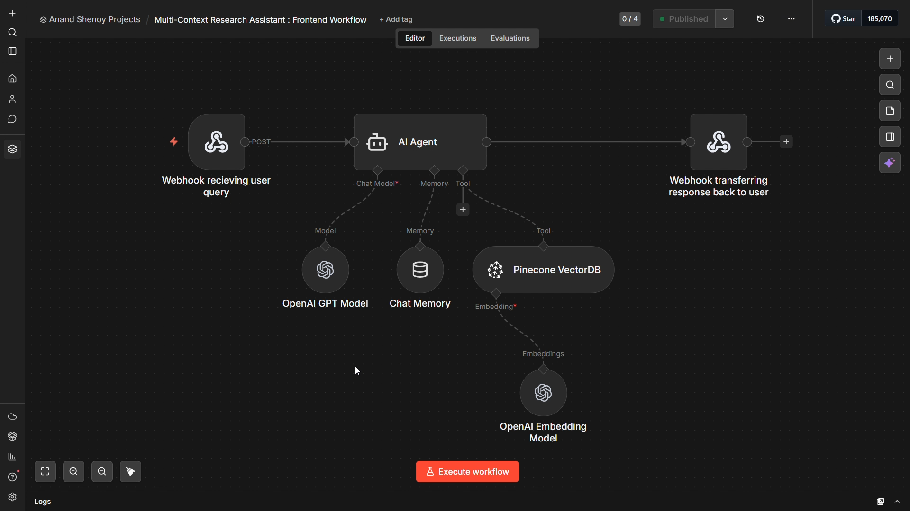

# 🔬 Multi-Context Research Assistant

An AI Agent-powered dual-workflow system built on n8n that automatically ingests research documents from Google Drive into a Pinecone vector database and answers user queries through a strict RAG pipeline — retrieving only what is explicitly present in the document and refusing to respond beyond it, ensuring factually grounded and hallucination-free answers.

## 📖 Overview

Researchers and students working with dense academic papers struggle to extract precise answers quickly — manually scanning documents is time-consuming, and general-purpose LLMs hallucinate information that isn't in the source material, making them unreliable for document-specific queries.

This project addresses that by splitting the system into two dedicated n8n workflows. The Backend Workflow watches a Google Drive folder for new documents, downloads them, chunks and embeds them using OpenAI embeddings, and stores the vectors in a Pinecone index. The Frontend Workflow exposes a webhook endpoint that a Streamlit interface calls — the AI Agent receives the user's query, mandatorily retrieves context from Pinecone, generates a grounded answer using GPT-4o mini with persistent session memory, and returns the response back through the webhook.

## ✨ Key Features

* **Dual-Workflow Architecture:** Two independent n8n workflows — one handling document ingestion and the other handling query answering — keeping data pipeline and conversational logic cleanly separated.
* **Automated Document Ingestion:** A Google Drive Trigger monitors the folder and automatically processes any newly uploaded PDF without manual intervention.
* **Chunked Vector Embedding:** Documents are split into 500-character chunks with 100-character overlap using a Recursive Character Text Splitter before being embedded and stored in Pinecone.
* **Strict Hallucination Control:** The AI Agent is constrained by an engineered system prompt that mandates tool usage before every response and explicitly refuses to answer anything not found in the retrieved document context.
* **Persistent Session Memory:** A Buffer Window Memory node maintains conversation history across turns using a key, enabling coherent multi-turn research conversations.
* **Streamlit Frontend Integration:** A Webhook trigger and Respond to Webhook node bridge the n8n backend to an external Streamlit chat interface via HTTP POST requests.

## 🛠️ Technologies

* **Workflow Orchestration:** n8n (Community Edition — free, self-hosted)
* **Document Source & Trigger:** Google Drive (OAuth2 — folder watch trigger + file download)
* **Text Processing:** n8n Recursive Character Text Splitter (chunk size: 500, overlap: 100)
* **Embedding Model:** OpenAI Embeddings (`text-embedding-3-small` via n8n free OpenAI credits)
* **Vector Database:** Pinecone (index with 1536 dimensions)
* **LLM:** OpenAI GPT-4o mini (via n8n free OpenAI credits)
* **AI Orchestration:** n8n AI Agent Node (RAG — retrieve-as-tool mode)
* **Session Memory:** n8n Buffer Window Memory Node
* **Frontend Interface:** Streamlit (communicates via Webhook POST to `/chat`)

## 🔄 Workflow Architecture

The system runs as two separate workflows. The Backend Workflow triggers automatically when a new PDF is uploaded to the designated Google Drive folder, downloads it, loads and chunks the content, generates OpenAI embeddings, and inserts the vectors into the Pinecone index. The Frontend Workflow receives user queries from the Streamlit interface via a webhook, passes them to the AI Agent which mandatorily queries Pinecone for relevant context, generates a grounded response using GPT-4o mini with session memory, and returns the answer back through the webhook to the user.

## 📝 Prerequisites

* An n8n instance — self-hosted via `npm install -g n8n` (Node.js v20+) or n8n Cloud free trial at `app.n8n.cloud`
* An OpenAI API key with access to `gpt-4o-mini` and `text-embedding-ada-002` (or n8n free OpenAI credits)
* A Pinecone account (free tier) with an index named `multi-context-research-assistant-index` created
* A Google account with OAuth2 access granted to n8n and a Google Drive folder designated for research paper uploads
* A Streamlit application configured to send POST requests to the n8n Frontend Workflow webhook URL at `/chat`

## 🎥 Project Demonstration

Click to watch the demo!

  

